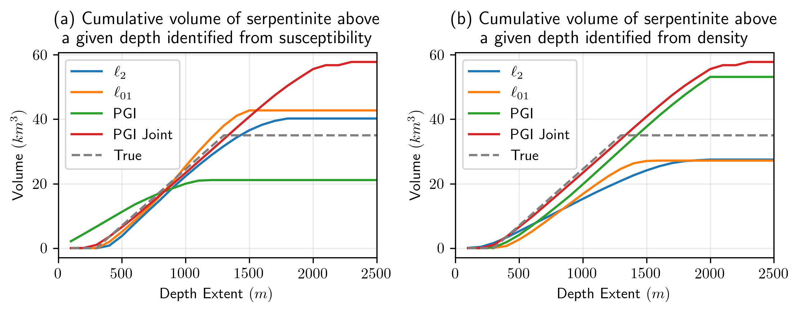

# Geophysical inversions to delineate rocks with CO2 sequestration potential through carbon mineralization 

_Lindsey J. Heagy, Thibaut Astic, Joseph Capriotti, John Weis and Douglas W. Oldenburg_

https://doi.org/10.48550/arXiv.2203.13894



## Summary

In addition to reducing anthropogenic emissions of CO$_2$, it is increasingly clear we also need to remove CO$_2$ from the atmosphere in order to avoid some of the worst case scenarios for climate change. Geologic sequestration of CO$_2$ is among the most attractive approaches because of the large global capacity and long-time scales for storage. One mechanism of geologic storage is through carbon mineralization. Some mafic and ultramafic rocks contain minerals that will react with CO$_2$ in a carbonation reaction and convert it to carbonated minerals. This is effectively a permanent CO$_2$ storage mechanism. The geologic question we are faced with is then to locate, delineate and estimate the volume of potentially reactive rocks. Using a synthetic model that emulates a prospective site for carbon mineralization in British Columbia, we simulate and invert gravity and magnetic data to delineate reactive rocks. We begin by inverting each data set independently and introduce a proxy experiment to contend with the challenging problem of choosing an appropriate physical-property threshold to estimate volumes from the recovered model. We use this proxy experiment to estimate thresholds for standard, $\ell_2$ inversion of the gravity and magnetics, as well as for inversions which use sparse and compact norms. A Petrophysically and Geologically Guided Inversion (PGI) framework is used to construct quasi-geologic models from which volumes can be estimated directly. We apply the PGI framework to the magnetics and gravity data independently. The framework is also used to jointly invert these data and produce a model that is consistent with both data sets. Cumulative volume estimates with depth are informative and can help decide whether in situ or ex situ sequestration might be appropriate. Using each of the inverted models, we estimate cumulative volume of reactive rock as a function of depth. 

## Citation

Fasttimes. (2022, June 4). Geophysical Inversions to Delineate Rocks with CO2 Sequestration Potential Through Carbon Mineralization. FastTIMES Online. https://fasttimesonline.co/geophysical-inversions-to-delineate-rocks-with-co-2-sequestration-potential-through-carbon-mineralization/

```
@article{heagy_inversion_2022,
      title={Geophysical inversions to delineate rocks with CO$_2$ sequestration potential through carbon 
      mineralization}, 
      author={Lindsey J. Heagy and Thibaut Astic and Joseph Capriotti and John Weis and Douglas W. Oldenburg},
      year={2022},
      eprint={2203.13894},
      archivePrefix={arXiv},
      primaryClass={physics.geo-ph}
}

```
